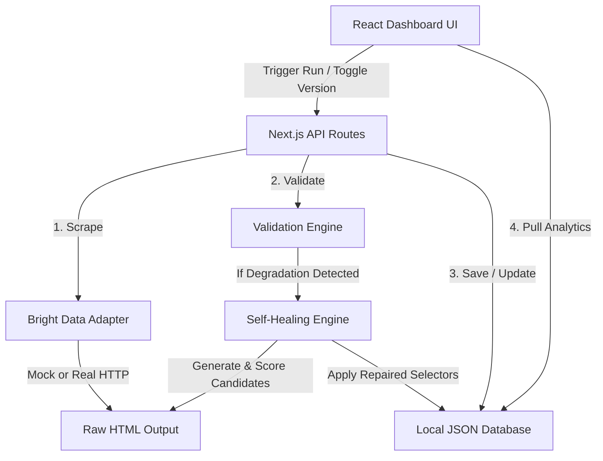

# Architecture Overview

WebPulse AI uses a modular architecture built on top of Next.js API Routes and React frontend components.

## Core Modules

### 1. Database Store (`src/lib/db.ts`)
A lightweight, file-backed JSON database store (`db.json`) that manages:
- **Monitors**: Active scraping tasks, schema specifications, and selector configurations.
- **Scrapers**: Active pipeline statuses, record tallies, and performance success rates.
- **ExtractionRuns / ExtractionRecords**: Full history of scraped items.
- **RepairEvents**: Detailed audit logs of self-healing telemetry.
- **ActivityEvents / Logs**: Diagnostic logs.

### 2. Bright Data Adapter (`src/lib/brightdata.ts`)
Decouples scraping triggers from our system logic.
- In **Real Mode**, uses Scraper Studio's DCA REST APIs to trigger runs and poll datasets.
- In **Simulation Mode**, generates simulated HTML layouts locally for developer speed.

### 3. Cheerio Extractor (`src/lib/extractor.ts`)
Encapsulates DOM traversal. Clean CSS selectors are applied to raw HTML layouts, parsing currencies and ratings into clean numeric representations.

### 4. Validation Engine (`src/lib/validation.ts`)
Applies schema rules (required fields, type assertions, numeric boundaries) to extracted records. Calculates a quantitative confidence rating and detects field failures.

### 5. Self-Healing Engine (`src/lib/self-healing.ts`)
Executes recovery. When a field breaks, it analyzes container elements, generates tag/class/attribute selector permutations, tests them, applies semantic match bonuses, and records repairs.
