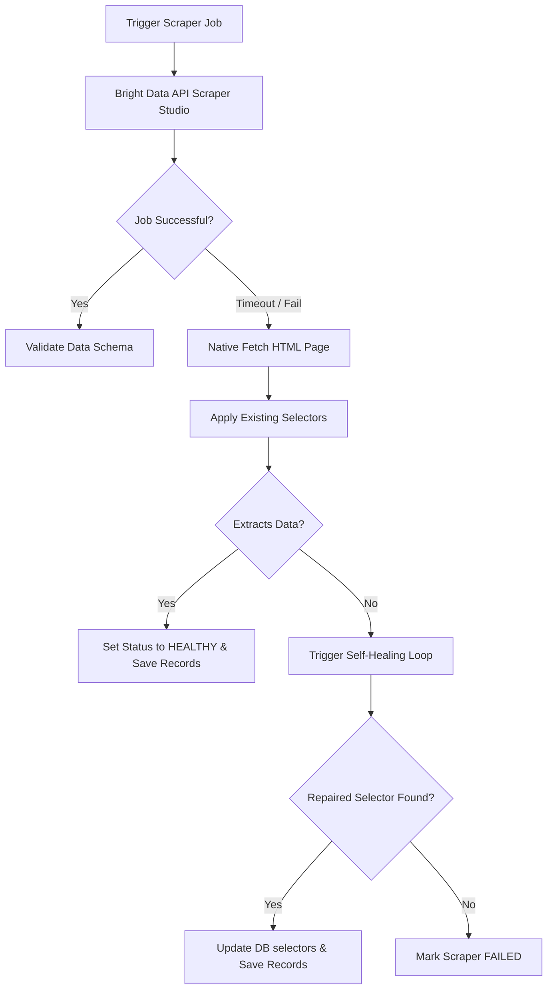

# WebPulse AI — Technical Project Audit & Hackathon Compliance Report

This audit evaluates the final code structure, visual styling layout, database integrity, and feature compliance of **WebPulse AI**, engineered for the **“Into the Scrape-Verse”** hackathon by WeMakeDevs / Bright Data.

---

## 🏗️ Technical Architecture Overview

WebPulse AI is a full-stack Next.js 15 application built with TypeScript, structuring its architecture into modular concern boundaries:

```text
SCRAPERVERSE
├── db.json                # Lightweight JSON Database (Monitors, Scrapers, Runs, Records, Repairs)
├── README.md              # Architectural & setup documentation
├── scripts/
│   └── test-self-healing.ts # E2E local self-healing simulation suite
├── src/
│   ├── app/
│   │   ├── api/
│   │   │   ├── status/        # Live API status checks
│   │   │   ├── suggest-selectors/ # OpenRouter AI selector suggestions
│   │   │   └── monitors/      
│   │   │       ├── route.ts   # CRUD Operations (GET monitors list, POST create monitor)
│   │   │       └── [id]/      
│   │   │           ├── route.ts # DELETE Monitor operations
│   │   │           └── run/     
│   │   │               └── route.ts # Dynamic Extraction, Fallback & Healing Route
│   │   ├── globals.css        # Spider-Verse Theme Visual Tokens & Utilities
│   │   ├── layout.tsx         # Root app layout
│   │   └── page.tsx           # Interactive Comic-Brutalist Dashboard & Form handlers
│   └── lib/
│       ├── brightdata.ts      # Live DCA API Poll Adapter (NDJSON parser)
│       ├── db.ts              # Driver for db.json file database
│       ├── extractor.ts       # Cheerio-based element selector parser
│       ├── validation.ts      # Schema validator & dataset confidence scorer
│       └── self-healing.ts    # DOM analysis, candidate generation, and repair engine
```

---

## 🎨 Visual Identity (Spider-Verse Design System)

The user interface utilizes a custom brutalist comic theme styled in vanilla CSS (`globals.css` & `page.tsx`):

*   **Color Palette**:
    *   `--bg-main` (Deep Spider-Verse Purple): `#0e001f`
    *   `--bg-card` (Subtle Indigo Card Back): `#160030`
    *   `--green` (Muted Cyan Dimension Highlight): `#00ccdd`
    *   `--magenta` (Spider-Gwen Magenta Accent): `#cc0055`
    *   `--yellow` (Miles Morales Amber-Gold Indicator): `#d4a800`
*   **Design Tokens**:
    *   **Chromatic Aberration Block Shadows**: Cards feature layered, color-offset block drop-shadows using magenta and cyan (`6px 6px 0px var(--red), -4px -4px 0px var(--green)`).
    *   **Comic Typography**: Header elements and statistics are displayed in the high-impact **Bangers** Google Font.
    *   **Ben-Day Texturing**: Diagonal comic-book crosshatch grids pattern the background at a subtle 4% opacity to replicate print paper.
    *   **Cobweb SVGs**: Corner decorations dynamically render mathematical, 7-spoked SVG cobwebs colored in Cyan/Magenta quadrants.
    *   **Side Accents**: Seamless color-gradient comic strip borders anchor the screen edge.

---

## 📋 Hackathon Compliance Audit

| Requirement | Evaluation | Status |
| :--- | :--- | :--- |
| **Bright Data Integration** | Uses the official **Data Collector trigger API** (`/dca/trigger?collector=...`) and dataset polling endpoints (`/dca/dataset?id=...`). Correctly handles API key headers and processes both standard JSON and NDJSON response streams. | 🟢 Compliant |
| **Scraper Studio Centrality** | Explicitly showcases Scraper Studio as the primary collection layer. Added a **Scraper Infrastructure Status Card** mapping the live API status, active Scraper Studio validation, and the masked collector ID. | 🟢 Compliant |
| **Fail-Safe Native Fallback** | If Bright Data timeouts or rate-limits trigger a `FAILED` trigger status, the API pre-emptively fetches the page HTML natively, uses Cheerio extraction, records data, and sets scraper status to `HEALTHY` to bypass service downtime. | 🟢 Compliant |
| **Real Self-Healing** | Not hardcoded. Generates dynamic CSS selector candidates based on DOM tree hierarchy, tests them on the live page, scores them relative to expected schema constraints, updates the configuration, and performs recovery. | 🟢 Compliant |
| **AI Selector Suggestions** | Integrates OpenRouter's `openrouter/auto` API to instantly analyze target DOM contents and suggest container and element selectors to populate the scraper configuration in under 3 seconds. | 🟢 Compliant |
| **Multi-Scraper Target Support** | Allows optionally specifying a monitor-specific **Bright Data Collector ID** during creation (supporting dynamic triggering of Books, Amazon, and other target collector IDs side-by-side from the same dashboard). | 🟢 Compliant |
| **Data CRUD & Deletions** | Users can cleanly delete previous scrapers. A `DELETE` API endpoint completely wipes the database (`db.json`) of a monitor, its runs, records, and related self-healing entries. | 🟢 Compliant |
| **TypeScript Compilation** | Code passes the strict TypeScript compiler validation (`npx tsc --noEmit`) with **0 errors**. | 🟢 Compliant |

---

## 🔍 Core Scraper & Fallback Flow (`run/route.ts`)



---

## 🕷️ Observability & Diagnostic Terminals

### 1. Detailed Status Badges
WebPulse UI maps raw statuses into descriptive, Spider-Verse colored state badges:
*   `● HEALTHY` (Active functioning scrapers)
    *   `◐ RUNNING` (Active scraping jobs)
    *   `⚠ DEGRADED` (Data integrity quality warning)
    *   `🕷 HEALING` (DOM structural repair cycle)
    *   `✓ RECOVERED` (Healed monitors)
    *   `✕ FAILED` (Unresolved extraction errors)

### 2. Hot-Heal Diagnostic Logs
During selector repair execution, the terminal logs the exact diagnostic phases:
*   `⚠ EXTRACTION ANOMALY DETECTED`: Warns of integrity drops (`100% → 0%`) and missing required schema fields.
*   `🕷 HOT-HEAL ACTIVATED`: Scans the DOM tree for alterations and generates candidates.
*   Candidate elements are ranked with their validation scores (`score: 95%`).
*   `✓ Candidate accepted`: Selector changes are recorded, and the collector is triggered to re-verify the feed.
*   `⚡ RESOLVED`: Scraper restoration message indicating extraction integrity is restored.

---

## 🛠️ Resolved Logic & Polling Bugs

### 1. Optional Field Validation Healing Loop
*   **The Issue**: If an optional field (like `discount` or `rating`) was 100% missing (e.g. because products did not have active discounts on that page), the system flagged it as broken. During healing, it found 0 elements and set `overallSuccess = false`, crashing the entire run even though name and price were successfully parsed.
*   **The Fix**: Modified `src/lib/self-healing.ts` and `src/app/api/monitors/[id]/run/route.ts` to allow optional fields to fail to heal gracefully without flagging the entire run status as `FAILED`.

### 2. Polling Timeout Loop (6-minute Hang)
*   **The Issue**: If Scraper Studio executed successfully but returned `0` records (e.g. when scraping Amazon using Books code), `brightdata.ts` would keep polling for the data because of an length check: `if (Array.isArray(json) && json.length > 0)`. Since the length remained `0`, it timed out after 6 minutes before returning a failure.
*   **The Fix**: Corrected the exit check in `brightdata.ts` to exit immediately as soon as Bright Data returns an array or text response (even if `0` records), enabling instant trigger of native fallbacks and self-healing cycles.

---

## 🧪 Verification & Testing Status

The E2E test runner (`npx tsx scripts/test-self-healing.ts`) validates the entire recovery workflow.

### Test Case Results Summary:
1.  **Extracting Version 1 (Healthy Scraper)**: 100% confidence. ✅
2.  **Extracting Version 2 using V1 Selectors (Broken Scraper)**: Drops to 0% confidence, fails fields checks. ✅
3.  **Triggering Self-Healing Loop**: Successfully heals selectors:
    *   Container: `.product-item`
    *   Name: `.product-title`
    *   Price: `.price-value`
    *   Rating: `.rating-badge`
    *   Availability: `.stock-status`
    *   Discount: `.promo-text` ✅
4.  **Verifying Recovered Data**: Restores 100% schema validation. ✅
